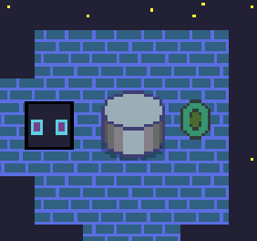
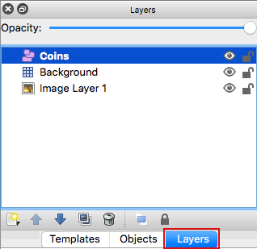
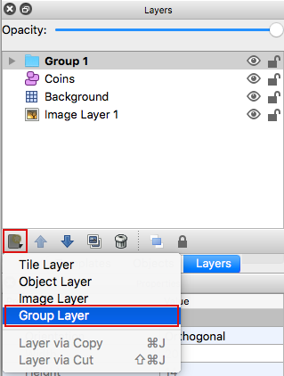
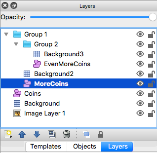

# haxeflixel-tiled-grouped-layers-demo

This is a demo for Addiing Support for Tiled Grouped Layers to HaxeFlixel.

HaxeFlixel/flixel-addons issue: [319](https://github.com/HaxeFlixel/flixel-addons/issues/319)

### Use Case

Group layers can be added in Tiled to help organize other layers. 
Currently `TiledMap` loads layers which are direct children of **Layers** in Tiled. 
This feature will allow `TiledMap` to load nested children of **Layers**.

  
*Various objects and layers added to Tiled Group Layers*

### In Tiled Editor

To add a Group Layer in Tiled:

1. Select **Layers**  

2. Select **New Layer** >> **Group Layer**  

3. Optionally add more layers of any type in the new Group Layer (including more Group Layers)  
